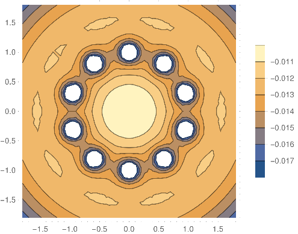
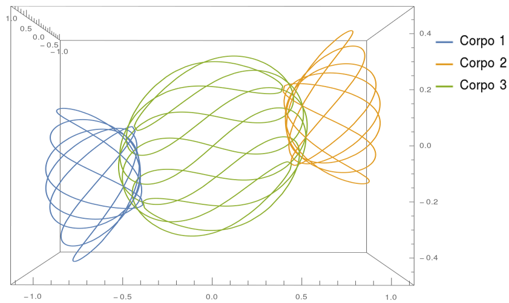
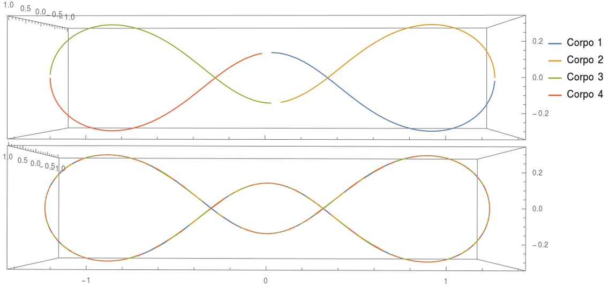
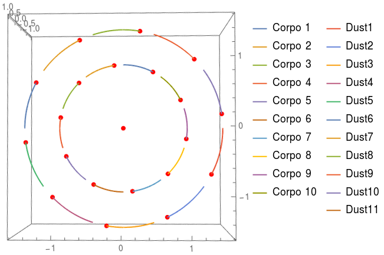

## Analytical Mechanics
**Final project**: Simulation of N-body gravitational dynamics in 3D

#### Samples:

* Effective potential in a comoving reference frame of a 10-body system:

* Butterfly III orbit:

* Super-Eight orbit:

* Orbit of 10 large bodies forming a regular decagon, with small masses (_dust_) in its equilibrium points:

* Small radial perturbation in the position of the central body of the regular decagon system (1 period):

